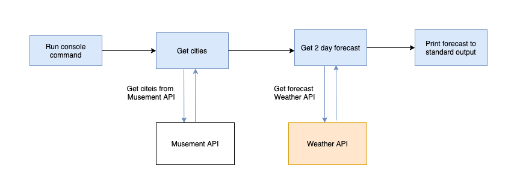

# Forecaster

Forecaster is command line application that gets forecast via Weather API for list of cities provided by Musement API.
Goal of this application is to demonstrate implementing all requirements while writing clean tested and
maintainable code.  

## Aplicaiton logic

## Arhitecture
This project uses set of components to solve the given problem. Goal is to demonstrate clear understanding of underlying 
components and concepts that are abstracted in typical modern frameworks.

Libraries chosen for this project: 
- [laminas/laminas-config-aggregator](https://github.com/laminas/laminas-config-aggregato) for application config
- [laminas/laminas-servicemanager](https://github.com/laminas/laminas-servicemanager)  for Dependency Injection container
- [guzzlehttp/guzzle](https://github.com/guzzle/guzzle) for making external api calls
- [symfony/console](https://github.com/symfony/console) for creating console command
- [phpstan/phpstan](https://github.com/phpstan/phpstan) for static analysis
- [phpunit/phpunit](https://phpunit.de/) for writing application tests

**Decisions**
- Each data providers (MusementAPI, WeatherAPI) is abstracted behind interface to make changing providers and testing easier
- Api calls could be cached for a certain amount of time 
As an example MusementProvider is decorated with [CachedCityProvider](https://github.com/jseparovic1/forecaster/blob/master/src/City/Provider/CachedCityProvider.php)
that stores response in array
- Symfony serializer is used to map api response data to dedicated data transfer classes 
- Custom application exceptions are created for easier error debugging and understandable application flow 
- All exceptions, invalid api responses and important events in application should be logged in real application but it is skipped here  
 
## Usage

1. Get api key from https://www.weatherapi.com and use it instead of API_KEY in cli command.

2. Build 

    docker build -t jseparovic/forecaster .

3. Run 

    docker run --rm -it -e WEATHER_API_KEY='API_KEY' jseparovic/forecaster composer cities:forecasts

**For development install and add dependencies to host**

    docker run --rm --interactive --tty --volume $PWD:/app composer install

## Quality assurance 
Use following command to run tests and check static analysis errors.

    docker run --rm jseparovic/forecaster composer check

Run test only

    docker run --rm jseparovic/forecaster composer test

Run phpstan check only

    docker run --rm jseparovic/forecaster composer stan-check

